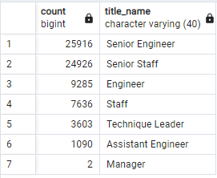
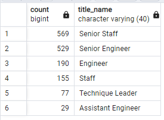
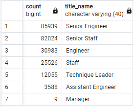
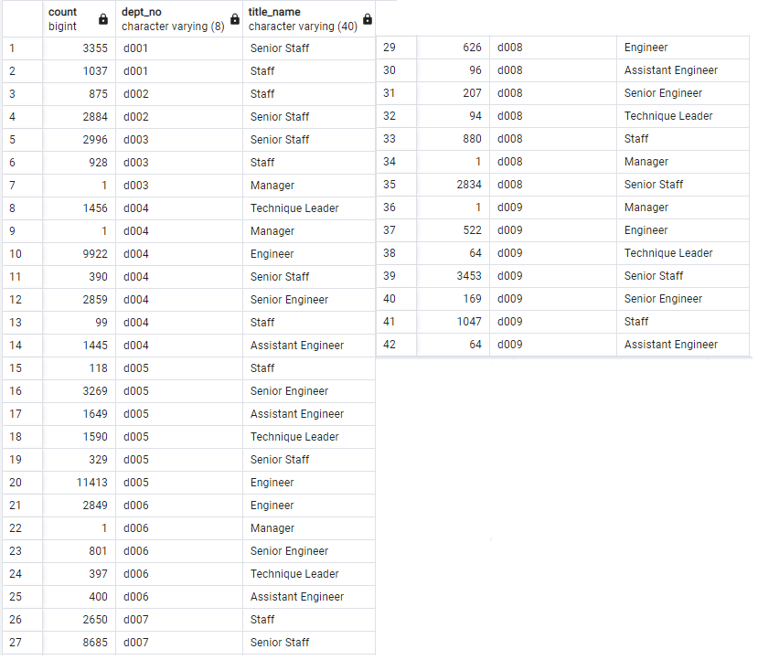
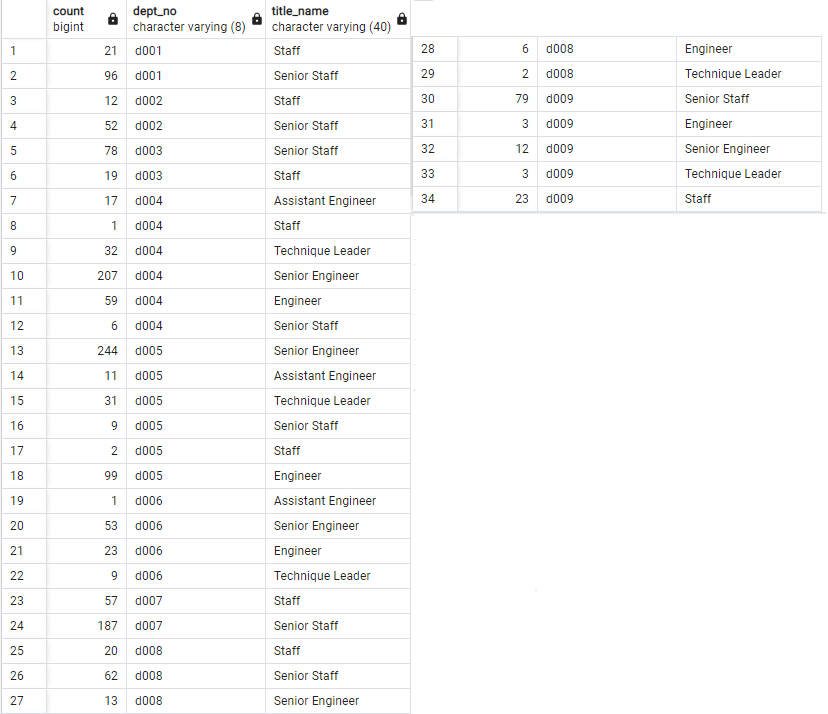
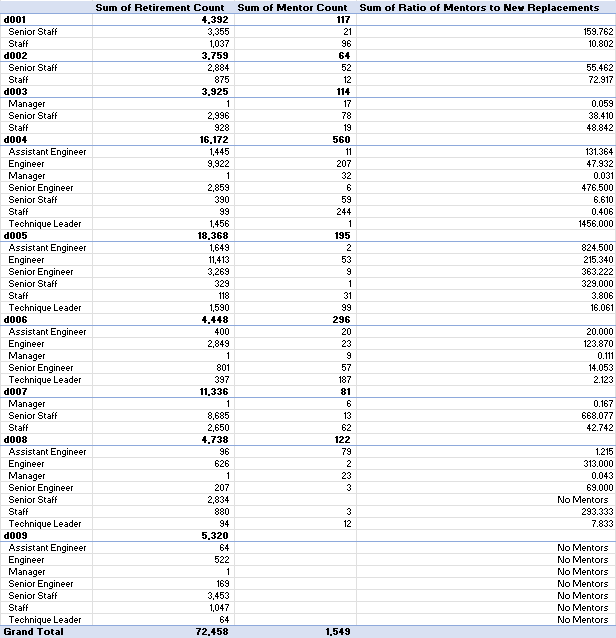

# Pewlett-Hackard Analysis with Structured Query Language (SQL): Analyzing Employee Retirement at Major Firms

## Overview of Project

### Background
Initially, there were six different datasets. The departments dataset lists out the nine department identifying numbers and the name of the departments. The department employee dataset includes employee identifying number, the department by number they are employed with, the from date of their employment, and the to date of their employment. This dataset is of includes 331,603 rows excluding the heading. The department manager dataset includes the department identifying number of the manager, the managers' employee identifying number, the from date of their employment, and the to date of their employment. This dataset includes 24 rows excluding the heading. The employees dataset includes employee identifying number, their birthday, their first name, their last name, their gender, and their hire date. This dataset includes 300,024 rows excluding the heading. The salaries dataset includes the employee identifying number, their salary, their start date, and their end date. This dataset includes 300,024 rows excluding the heading. The titles dataset includes employee identifying number, their title, the from date, and the to date. This dataset includes 443,309 rows. The differences between these datasets tracking employees are due to how employees may change roles over time as recorded. The to date of employment is typically 1/1/9999 for currently employed employees.

The datasets were then queried to make further datasets. The first dataset that was created from queries was retirement titles which presents employees by identifying number, their first name, their last name, their title, and the from date and to date of their employment if they were born between 1952 to 1955 making them roughly 70 to 66 years of age depending on their birthday. This included 133,776 rows excluding the heading. The second dataset that was created from queries was unique titles which incudes the employee identifying number, their first name, their last name, and their title if they are currently employed as determined if their to date of employment is reported as 1/1/9999. This includes 72,458 rows excluding the heading. The analysis went further by querying to create a dataset of retiring titles by the title names: including senior engineer; senior staff; engineer; staff; technique leader; assistant engineer; and manager, and the count of each title of which has currently employed employees who are of that age range and therefore likely to retire. Finally, a dataset was created for mentorship eligibility by querying for employee identifying number, their first name, their last name, their birthday, their from date, their to date, and their title name if they are currently employed and if their birthday was in 1965 which would make them around 56 to 57 years old now depending on their birthday. This dataset includes 1,549 rows excluding the heading.

### Purpose
The purpose of this analysis is to prepare for upcoming retirements in the firm. BY determining currently employed employees between roughly 66 to 70 years of age, we can determine the employees who are likely to retire which includes a significant percentage of the workforce at the firm. By compiling a list of these employees, including what their current role in the firm is, we can prepare for their upcoming retirement with currently senior employees, roughly 56 to 57 years old who are not expected to retire immediately, mentoring younger employees. In doing so, we can ensure that technical and institutional knowledge is passed down to younger employees and so to maintain productivity in the firm while not burdening the employees who are on the verge of retirement with additional work.

## Retirement Analysis Results

### Analysis Results

* There is a total of 72,458 roles that need to be filled at the firm as there are currently that number of employees between the ages of 66 to 70 who are born between 1952 to 1955 who are currently employed.

* Above shows that there is currently employed employees between the ages of 66 to 70 who are born between 1952 to 1955 for the firm by their roles includes: 25,916 senior engineers, 24,926 senior staff, 9,285 engineers, 7,636 staff, 3,603 technique leaders, 1,090 assistant engineers, and 2 managers.

* There are 1,549 currently employed employees, at the given age range of 56 to 57 born in 1965, who are therefore eligible for mentorship program at the firm.

* Above shows that there is currently employed employees at the given age range of 56 to 57 born in 1965, who are therefore eligible for mentorship program at the firm by their roles include: 569 senior staff, 529 senior engineers, 190 engineers, 155 staff, 77 technique leaders, and 29 assistant engineers.

## Summary

### Response to Firm Questions Regarding Upcoming Retirement

As established, there are 72,458 roles that include currently employed employees who are ages of 66 to 70 who are born between 1952 to 1955. Presuming all these roles are still required then this entails that there are 72,458 roles that need to be filled. Above shows that this is out of 240,124 total employees which entails that 30.18% of firm employees who are currently employed are ages of 66 to 70 who are born between 1952 to 1955 and likely to retired.

There is a total of 85,939 senior engineers, 82,024 senior staff, 30,983 engineers, 25,526 staff, 12,055 technique leaders, 3,588 assistant engineers, and 9 managers employed at the firm. From the previously determined number of employees by role who are likely to retire then we can state that 30.16% of senior engineers, 30.39% of senior staff, 29.97% of engineers, 29.91% of staff, 29.89% of technique leaders, 30.38% of assistant engineers, and 22.22% of managers are expected to retire due to their age.

Presuming that the qualified, retirement-ready employees are the 1,549 determined before and that all 72,458 roles require to be filled then it is unlikely the current specifications for the mentorship program of being born in 1965 is likely to entail that there will be enough employees in the mentorship program to train the next generation of firm employees. Presuming that employees of the same role will train their new externally hired colleagues then each senior engineer in the mentorship program will have to mentor 49 new senior engineers, each senior staff in the mentorship program will have to mentor 44 new senior staff, each engineer in the mentorship program will have to mentor 49 new engineers, each staff in the mentorship program will have to mentor 49 new staff, each technique leader in the mentorship program will have to mentor 47 new technique leaders, each assistant engineer in the mentorship program will have to mentor 38 new assistant engineers. If some of the positions are filled with internal promotions and the newly promoted employees are still expected to be mentored, then the proportions will be the same for all of the non-entry level roles but with worse proportions for the entry level roles such as assistant engineers.

The first table shows currently employed employees of the firm who are ages of 66 to 70 years old who are born between 1952 to 1955 who are expected to retire but including the specification of the departments. The second table shows currently employed employees of the firm who are ages 56 to 57 years old born in 1965, therefore eligible for the mentorship program, but including the specification of the departments. The mentors to replacements matrix are too large to note well in text but it is displayed in a tabular form below.

Presuming that employees will mentor those of the same department and occupation title then the situation appears differently for different combination of department and occupation title. For department four and managers, there is a ratio of 32 mentors to 1 manager who is retiring and likely to be replaced by someone of the upcoming generation. This is in contrast to department four and technique leaders, where there is a ratio of 1 mentor to 1,456 technique leaders retiring and likely to be replaced by someone of the upcoming generation. Additionally, there are 8 combinations of department and occupation where there are no mentors, 7 of which are in department nine. There are certainly not enough qualified, retirement-ready employees in the departments to mentor the next generation of Pewlett-Hackard employees in the majority of combinations of department and role
